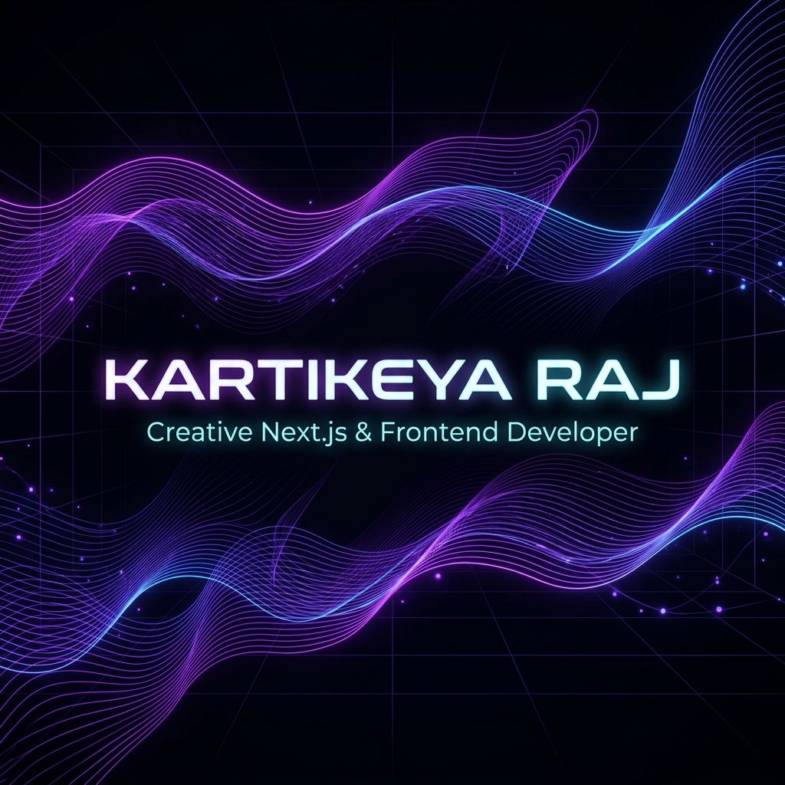
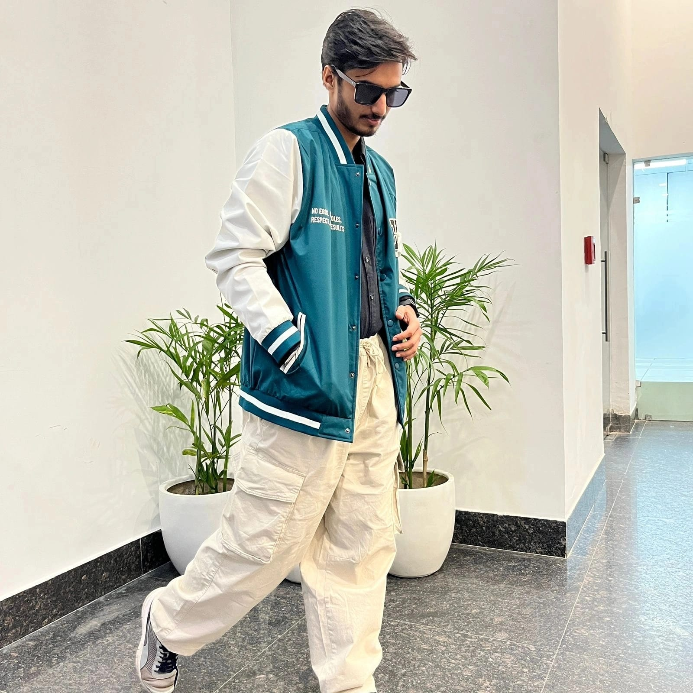
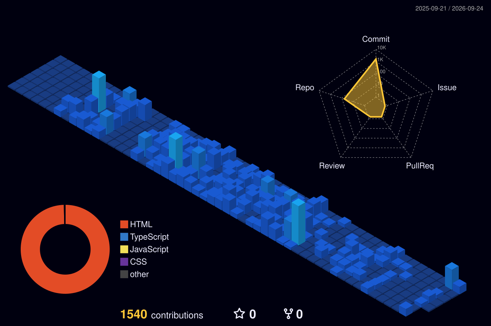

  

<h1 align="center">Hi there, I'm Kartikeya Raj! 👋</h1>

  

  <strong>Full Stack Developer | Next.js · React · Node.js · Animations · Web Performance</strong>

  
  &nbsp;
  

---

### 💫 About Me

I'm a passionate **Full Stack Developer** who builds premium, high-performance web applications — from crafting immersive animated frontends to robust backend systems and API integrations.

- 🚀 Currently building premium **Next.js** & **React** full stack applications.
- 🎨 Obsessed with UI aesthetics — smooth scrolling, dark modes, micro-interactions & fluid motion.
- ⚡ Expert in web performance, advanced SEO architecture, and clean developer workflows.
- 🛠️ Experienced in client-facing products and internal tools (CRM, ERP, dashboards).
- 📫 Reach me at: **kartikeya.raj29@gmail.com**

---

### 🛠️ Tech Stack

**Frontend**

  

**Animations & 3D**

  
  &nbsp;
  
  &nbsp;
  
  &nbsp;
  

**Backend & Database**

  

**Tools & DevOps**

  
  &nbsp;
  

---

### 📁 Projects

#### ✈️ [Rama Overseas](https://github.com/webramaoverseas-lgtm/ramaoverseas)
*Premium Next.js web app for an international tour, travel & visa consultancy agency.*
- 🎨 GSAP · Framer Motion · Lenis Smooth Scroll for high-fidelity transitions
- ☁️ Automated Cloudinary API asset sync & next-gen image optimization
- ⚡ Schema markups, canonical URLs & web vitals optimization
- `Next.js` `TypeScript` `Tailwind CSS` `Nodemailer` `Nixpacks`

---

#### 🌐 [Personal Portfolio](https://github.com/kartikeya1213/kartikeyaraj)
*Personal developer portfolio website.*
- `React` `CSS`

---

#### 🎯 [3D Portfolio](https://github.com/kartikeya1213/3d-portfolio)
*Immersive 3D interactive portfolio website.*
- `Three.js` `React`

---

#### 💼 [Digital Vibe Solutions — Website](https://github.com/kartikeya1213/digitalvibesolutions)
*Digital marketing agency website.*
- `React` `Node.js`

---

#### 🗂️ [Digital Vibe CRM](https://github.com/kartikeya1213/digitalvibe-crm)
*Internal full-stack CRM — multi-role auth, client management, task tracking & lead pipeline.*
- `React` `Node.js` `MySQL`

---

#### 🪵 [Arora Yarn Traders](https://github.com/kartikeya1213/arorayarntraders)
*Business website with product catalogue & email inquiry integration.*
- `Next.js` `Tailwind CSS`

---

#### 💰 [Capital Gains Calculator](https://github.com/kartikeya1213/capital-gains)
*Real-time capital gains tax calculator and chart visualizer.*
- `React` `JavaScript`

---

#### 🛍️ [E-Commerce Platform](https://github.com/kartikeya1213/e-commerce)
*Full-featured e-commerce — product listings, cart, checkout & order management.*
- `React` `Node.js` `MySQL`

---

#### 📦 [ERP — Rock Gain](https://github.com/kartikeya1213/erp-rockgain)
*Enterprise Resource Planning — inventory, orders & reporting dashboards.*
- `React` `Node.js` `MySQL`

---

#### 🏋️ [Gym Dashboard](https://github.com/kartikeya1213/gym-dummy)
*Fitness center management — members, subscriptions & attendance.*
- `React` `Node.js`

---

#### 🎨 [Aesthtica](https://github.com/kartikeya1213/aesthtica)
*Premium beauty & lifestyle brand with immersive scroll animations.*
- `Next.js` `GSAP` `Framer Motion`

---

#### 🎭 [Art & Culture Festival — Full Stack](https://github.com/kartikeya1213/artculturefestival-full)
*Event platform — schedule, gallery & registration.*
- `Next.js` `Node.js`

---

#### 🎭 [Art & Culture Festival — Static](https://github.com/kartikeya1213/artculturefestival-static)
*Static version of the Art & Culture Festival website.*
- `HTML` `CSS` `JavaScript`

---

#### 💍 [Wedding Invitation](https://github.com/kartikeya1213/wedding-invitation)
*Animated digital wedding invitation with RSVP functionality.*
- `React` `CSS Animations`

---

#### 💍 [Wedding Invitation v2](https://github.com/kartikeya1213/wedding-invitation-2)
*Second animated digital wedding invitation.*
- `React` `CSS Animations`

---

#### 💎 [Kollabix — Agency Portal](https://github.com/kartikeya1213/kollabix-a)
*Agency side of the two-sided influencer marketing platform.*
- `React` `Node.js`

---

#### 💎 [Kollabix — Influencer Portal](https://github.com/kartikeya1213/kollabix-influencer)
*Influencer side — campaigns, analytics & collaboration tools.*
- `React` `Node.js`

---

#### 🎪 [Tyohaar](https://github.com/kartikeya1213/tyohaar)
*Festival & event discovery platform with listings & registration.*
- `Next.js` `Tailwind CSS`

---

#### 🏦 [Bank Statement Analyzer](https://github.com/kartikeya1213/bank-statement)
*Parses, categorizes and visualizes bank statement PDFs.*
- `Python` `JavaScript`

---

#### ⚙️ [Gmail Automation](https://github.com/kartikeya1213/gmail-automation)
*Automated Gmail workflows — auto-reply, template sending & inbox management.*
- `Python` `Google APIs`

---

#### 🏗️ [Furniture Backend](https://github.com/kartikeya1213/furniture-backend)
*REST API for furniture e-commerce — products, orders & auth.*
- `Node.js` `Express` `MySQL`

---

#### ⛏️ [Mining](https://github.com/kartikeya1213/mining)
*Mining data project.*
- `JavaScript`

---

#### 🪨 [Rock Gain](https://github.com/kartikeya1213/rockgain)
*Rock Gain business platform.*
- `React` `Node.js`

---

#### 👕 [Example Clothing](https://github.com/kartikeya1213/example-clothing)
*Clothing e-commerce example project.*
- `React`

---

#### 🧩 [Browser Extension](https://github.com/kartikeya1213/extension)
*Custom browser extension for productivity workflows.*
- `JavaScript` `Chrome Extension APIs`

---

#### 🎮 [Tic Tac Toe](https://github.com/kartikeya1213/tic_tac_toe)
*Interactive browser game — vanilla JS state machine & DOM logic.*
- `HTML` `CSS` `JavaScript`

---

#### 📊 [API Render Table](https://github.com/kartikeya1213/API-Render-Table)
*Renders JSON API feeds into filterable HTML tables.*
- `HTML` `CSS` `JavaScript`

---

#### 🐍 [Python Project](https://github.com/kartikeya1213/Python_Project)
*Python data processing and automation scripts.*
- `Python`

---

#### 📋 [Table Assignment](https://github.com/kartikeya1213/table-assignment)
*HTML/CSS table layout and styling.*
- `HTML` `CSS`

---

### 🤝 Connect & Network

* ✨ **I follow back!** Drop a follow and I'll return the favor. Let's connect and build a strong developer network!
* 💬 Ask me about: **Next.js, React, GSAP animations, and full-stack development**.
* 📧 Email: [kartikeya.raj29@gmail.com](mailto:kartikeya.raj29@gmail.com)

---

### 📊 GitHub Stats

  
  &nbsp;
  
  &nbsp;
  

  

  

  

